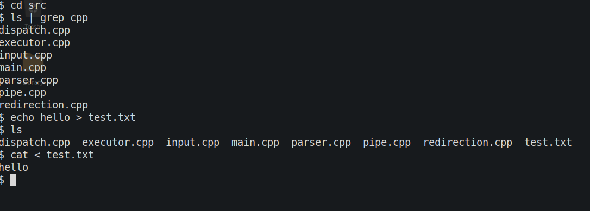

# pshell


A Unix-style shell built in C++17 that supports command execution, built-in commands, process creation, input/output redirection, and command piping using POSIX system calls.

## Features

* Execute external commands (`ls`, `cat`, `echo`, `date`, `whoami`, etc.)
* Built-in commands:

  * `cd`
  * `exit`
* Input redirection (`<`)
* Output redirection (`>`)
* Single command pipes (`|`)
* Command parsing and dispatch system
* Process management using POSIX APIs

## Technologies

* C++17
* CMake
* Linux
* POSIX System Calls

  * `fork()`
  * `execvp()`
  * `waitpid()`
  * `pipe()`
  * `dup2()`
  * `open()`

## Project Structure

```text
pshell/
├── include/
│   ├── dispatch.hpp
│   ├── executor.hpp
│   ├── input.hpp
│   ├── parser.hpp
│   ├── pipe.hpp
│   └── redirection.hpp
│
├── src/
│   ├── main.cpp
│   ├── dispatch.cpp
│   ├── executor.cpp
│   ├── input.cpp
│   ├── parser.cpp
│   ├── pipe.cpp
│   └── redirection.cpp
│
└── CMakeLists.txt
```

## Architecture

```text
User Input
     │
     ▼
 Tokenizer
     │
     ▼
  Parser
     │
     ▼
 Dispatcher
 ┌────┼────┐
 │    │    │
 ▼    ▼    ▼
Built-in  Redirection  Pipe
Commands
     │
     ▼
 External Command Execution
```

## Building

### Release Build

```bash
cmake -B build -DCMAKE_BUILD_TYPE=Release
cmake --build build
```

### Debug Build (AddressSanitizer + UBSan)

```bash
cmake -B build -DCMAKE_BUILD_TYPE=Debug
cmake --build build
```

## Running

```bash
./build/pshell
```

## Example Usage

```bash
$ ls

$ pwd

$ cd ..

$ echo hello > output.txt

$ cat < output.txt

$ ls | grep cpp
```

## Concepts Demonstrated

* Process creation and management
* Inter-process communication
* File descriptor manipulation
* Command parsing
* POSIX programming on Linux
* Modular C++ software design
* Build automation with CMake

## Future Improvements

* Multiple pipes
* Append redirection (`>>`)
* Background execution (`&`)
* Command history
* Job control
* Tab completion
* Environment variable expansion

```
```

